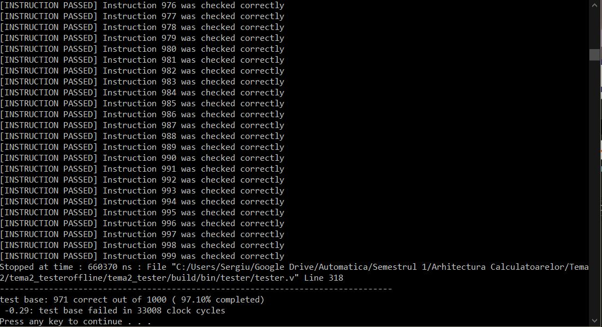

# Intel Avalon Arithmetic Logical Unit - Computer Architecture Assignment

Task was to implement the functionalities of an ALU, based on a master-slave principle. 
The code was based upon the Intel Avalon Memory scheme (slave), with the ALU being the master. 
The ALU had to fulfill basic functionalities/operations, such as ADD, AND, OR, XOR, DEC, INC, SHL, 
SHR, with different types of memory addressing and varying number of operands. 
Implemented in Verilog, using Xilinx IDE.

Passes 971/1000 Tests.

## Result


## Prerequisites
* Xilinx IDE v14.7, x64
* Tester and Project code

To test functionality of code, you must modify the *start_test.bat* script found at:

```bash
MasterFolder/Assignment_Offline_Tester/tema2_tester/start_test_bat
```

Make sure it looks something like:
```bash
@echo off

pushd scripts

call C:\Xilinx\14.7\ISE_DS\settings64.bat
call clean.bat noref
call build.bat nodup
call run.bat nobuild nogui

popd

pause
```
The Xilinx Path should be the one that applies to you.
